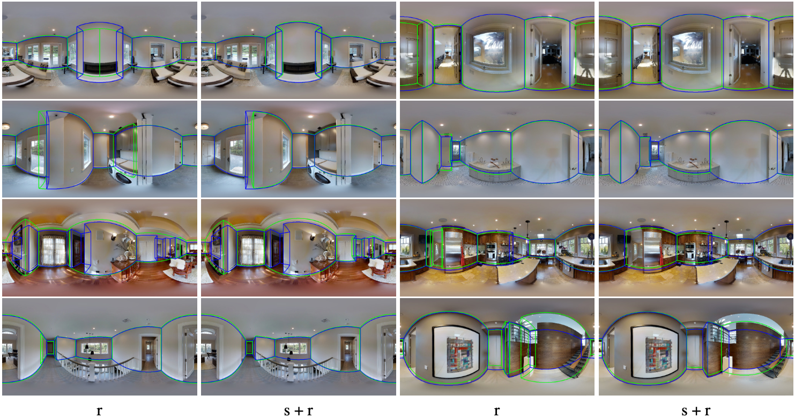
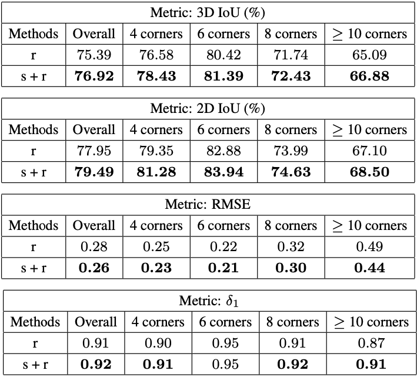

# Layout Estimation

## Introduction
Layout estimiation is a challenging task in 3D vision. Some datasets are proposed to tackle this problem, including the large scale synthetic dataset Structured3D. We will show th ability of Minvervas by agumentating the layout estimation task, which obtains state-of-the-art results.

## DSL code
<!-- For room layout estimation task, we create a
filter rule using DSL in the Scene Process Stage, and setting
the type of camera as “panorama”. We also use the sampler
of the transform component to randomly move cameras, and
use the output component to write out corner positions and
camera parameters. -->


First, we import some necessary packages.
```python
from ksecs.ECS.processors.scene_processor import SceneProcessor
from ksecs.ECS.processors.entity_processor import EntityProcessor
from ksecs.ECS.processors.pixel_processor import PixelProcessor
from ksecs.ECS.processors.structure_processor import StructureProcessor
import copy
import glm
```

We filter scenes that contain rooms for manhattan layout estimation in the Scene Process Stage.

```python
class ManhattanSceneFilter(SceneProcessor):
    def filter_scene(self):
        Valid = False
        for room in self.shader.world.rooms:
            corners = room.boundary
            shift_corners = copy.deepcopy(corners)
            shift_corners.append(shift_corners.pop(0))
            for i in range(len(shift_corners)):
                direction = glm.vec2(shift_corners[i]).xy - glm.vec2(corners[i]).xy
                direction = glm.normalize(direction)
                shift_corners[i] = direction
            EPSILON = 0.001
            MANHATTAN = True
            for i in range(len(shift_corners)):
                cos = glm.dot(shift_corners[i], shift_corners[(i + 1) % len(shift_corners)])
                if cos > EPSILON:
                    MANHATTAN = False
                    break
            if MANHATTAN:
                Valid = True
        return Valid

    def process(self):
        if self.filter_scene():
            print("get the expected scene")
        else:
            sys.exit(7) # Don't process this scene anymore.
```

For this task, we set the type of camera to panorama in the Entity Process Stage, and output the corner and camera parameters in the Entity Process Stage.

```python
class CameraSetting(EntityProcessor):
    def process(self):
        for camera in self.shader.world.cameras:
            camera.set_attr("imageWidth", 1024)
            camera.set_attr("imageHeight", 512)
            camera.set_attr("cameraType", "PANORAMA")
            camera.set_attr("position", x=1000, y=1000, z=800)
```


```python
class UserOutput(StructureProcessor):
    def process(self):
        # write out the corners of the rooms in the scene
        for room in self.shader.world.rooms:
            for plane, height in zip(["floor", "ceiling"], [0, self.shader.world.levels[0].height]):
                corners = []
                for corner in room.boundary:
                    corners.append({'x': corner[0], 'y': corner[1], 'z': height})
                self.shader.world.pick(
                    corners=corners,
                    catName=plane,
                    type='corners',
                    id=f"{room.roomId}_{plane}"
                )
        # write out cameras in the scene
        for camera in self.shader.world.cameras:
            self.shader.world.pick(
                type="camera",
                position=camera.position,
                id=camera.id
            )
```

## Minervas output sample

## Experimental Setup

In this experiment, we use MatterportLayout [[1, 2]](#1) as the real data. The dataset consists of 1,647 images for training, 190 images for validation, and 458 images for testing. Then, we synthesize 120K panorama images from 80K scenes using our system. Each panorama image corresponds to one room in scenes.
Following [[2]](#2), we adopt four standard metrics: 3D IoU,
2D IoU, RMSE and the accuracy under the threshold (δ1).
We adopt HorizonNet [[3]](#3) as the baseline approach. We use
an Adam optimizer with an initial learning rate of 3 × 10−4
with a polynomial decay policy. We set the mini-batch size
to 24. We also use two training strategies in this experi-
ment, i.e., “r” and “s + r”. In “s + r”, each batch contains
16 images from the real dataset and 8 from the synthetic
dataset. For each strategy, we train the whole network for
30K iterations

## Results
Results are reported in Table 1. As can be seen, the model trained on both the synthetic and real datasets achieves the best result. After augmenting the synthetic data, the network can predict the corners position more accurately. Meanwhile, the predicted number of corners is more accurate. It demonstrates that our synthetic data could be used to improve the performance of the network. Qualitative results are shown in Figure 2.




## References
<a id="1">[1]</a> 
Angel X. Chang, Angela Dai, Thomas A. Funkhouser, Maciej Halber, Matthias Nießner, Manolis Savva, Shuran Song, Andy Zeng, and Yinda Zhang. Matterport3d: Learning from RGB-D data in indoor environments. In 3DV, pages 667–676, 2017.

<a id="2">[2]</a> 
Chuhang Zou, Jheng-Wei Su, Chi-Han Peng, Alex Colburn, Qi Shan, Peter Wonka, Hung-Kuo Chu, and Derek Hoiem. Manhattan room layout reconstruction from a single 360 image: A comparative study of state-of-the-art methods. International Journal of Computer Vision, 2021.

<a id="3">[3]</a> 
Cheng Sun, Chi-Wei Hsiao, Min Sun, and Hwann-Tzong Chen. Horizonnet: Learning room layout with 1d representation and pano stretch data augmentation. In CVPR, pages 1047–1056, 2019.